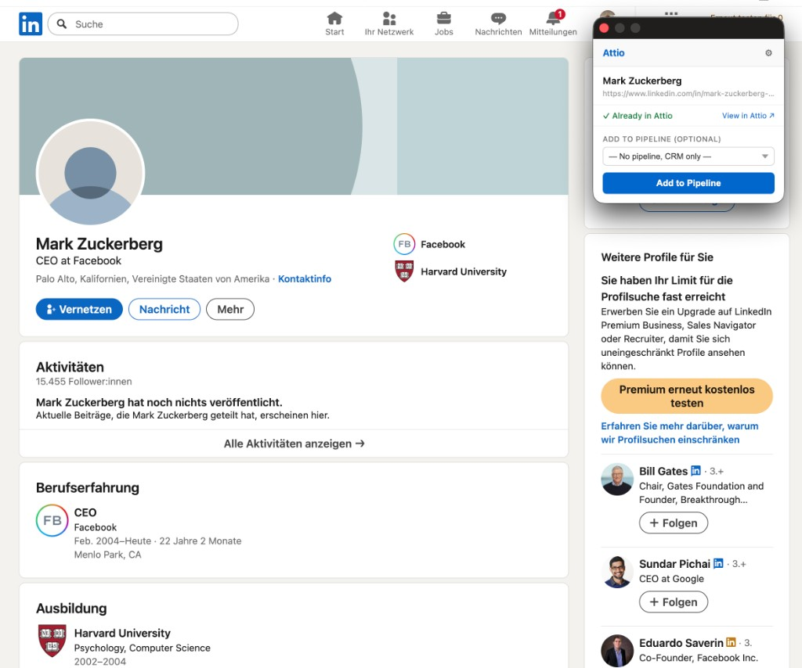

# LinkedIn → Attio

Chrome extension · Manifest V3 · uses the Attio REST API

Chrome extension that sends **LinkedIn profile pages** straight into [**Attio**](https://attio.com): check for duplicates, create people records, and optionally drop them onto a **list / pipeline** — without leaving LinkedIn.

  

Demo: profile preview, “Already in Attio” status, and optional pipeline.

## Features

- Works on `linkedin.com/in/…` profile URLs  
- Looks up existing people by **LinkedIn URL**, then by **name**  
- Creates a person with name, headline, and LinkedIn URL when new  
- Optional **pipeline / list** assignment (reads lists from your workspace)  
- **API key stays on your machine** — stored in `chrome.storage.local` only (never sent anywhere except Attio’s API)

## Privacy & security

- **No API key is bundled in the code.** You paste your Attio API token once in the extension settings; it is stored locally in your browser profile.  
- If you ever shared a key by mistake, **revoke it** in Attio and create a new one.

## Requirements

- **Google Chrome** (or another Chromium browser with MV3 support)  
- An Attio account with API access and a token that includes the scopes listed in the extension settings screen (see popup → ⚙).

## Install (load unpacked)

1. Clone this repository.  
2. Open `chrome://extensions`.  
3. Enable **Developer mode**.  
4. Click **Load unpacked** and select the `linkedin-attio-extension` folder (the one that contains `manifest.json`).  
5. Pin the extension if you like.  
6. Open **Settings** (⚙ in the popup) and paste your **Attio API key**, then save.

## Usage

1. Open any **LinkedIn profile** (`/in/username`).  
2. Click the extension icon.  
3. Review the preview, optionally pick a pipeline, then **Add to Attio**.

## Project layout

| File | Role |
|------|------|
| `manifest.json` | Extension manifest (MV3) |
| `content.js` | Profile page context (message bridge) |
| `popup.html` / `popup.js` / `popup.css` | Popup UI and Attio API calls |
| `icons/` | Toolbar icons |

## API

Calls are made to `https://api.attio.com/v2` using the Bearer token you configure. See [Attio API documentation](https://developers.attio.com/) for object and list behavior.

## License

MIT — see [LICENSE](LICENSE).

---

  Built for workflows that bridge outbound / research and CRM — not affiliated with LinkedIn or Attio.

